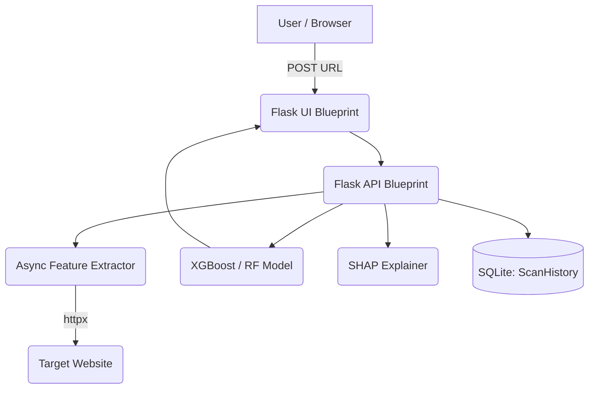

<div align="center">
  
  
  # PhishGuard Enterprise Edition
  
  **State-of-the-Art Machine Learning Phishing Detection**
  
  [](https://www.python.org/)
  [](https://flask.palletsprojects.com/)
  [](https://www.docker.com/)
  [](https://tailwindcss.com/)
  
</div>

---

## 🚀 Overview

PhishGuard Enterprise is a high-performance, modular cybersecurity SaaS prototype designed to detect phishing URLs in real-time. It leverages advanced Machine Learning models (Random Forest, Gradient Boosting, XGBoost), asynchronous HTML parsing, and SHAP (SHapley Additive exPlanations) to not only catch threats but explicitly explain **why** a site was flagged.

## ✨ Enterprise Features

- **Asynchronous Threat Intel**: Uses `httpx` and `BeautifulSoup4` to asynchronously fetch target HTML, inspecting for hidden iframes and suspicious password fields instantly.
- **Explainable AI (XAI)**: Integrated `SHAP` TreeExplainer provides human-readable context. Instead of just a "Phishing" label, the UI generates interactive Radar charts showing exactly which lexical or DOM features triggered the alarm.
- **Ultra-Premium UI**: Fully responsive, single-page application feel with a Glassmorphism aesthetic, `particles.js` cyber-background, dark mode default, and `Chart.js` dynamic visualizations.
- **Microservice Ready**: Implements Flask Blueprints and an isolated REST API endpoint (`/api/v1/analyze`), backed by an SQLite tracking database via SQLAlchemy.

## 🧠 Architecture Setup



## 🛠️ Installation & Setup

### Option 1: Docker (Recommended)
Spin up the entire application stack in one command:
```bash
docker-compose up --build
```
The app will automatically train the model on first launch and serve at `http://localhost:5000`.

### Option 2: Local Python Environment
1. Clone the repository and navigate to the directory.
2. Install dependencies:
   ```bash
   pip install -r requirements.txt
   ```
3. Initialize the database and train the ML model:
   ```bash
   python model/train_model.py
   ```
4. Run the backend:
   ```bash
   python app.py
   ```

## 📊 API Documentation

### POST `/api/v1/analyze`
**Request:**
```json
{
  "url": "http://secure-login-update.com"
}
```
**Response:**
```json
{
  "confidence": 98.4,
  "features": {
    "has_password_fields": 1,
    "url_length": 0,
    ...
  },
  "is_phishing": true,
  "shap_explanation": {
    "has_password_fields": 1.25,
    "having_ip_address": 0.84,
    ...
  },
  "url": "http://secure-login-update.com"
}
```
